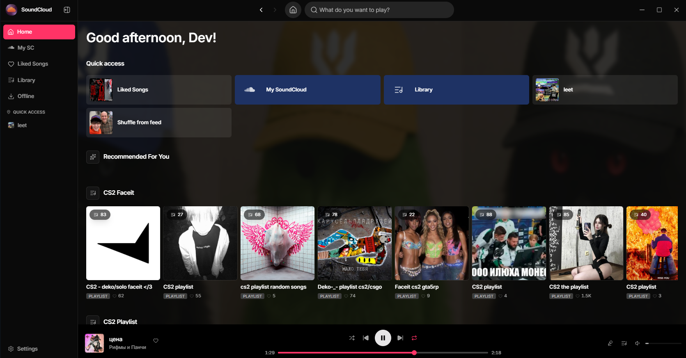
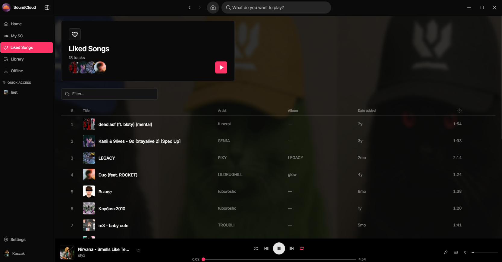
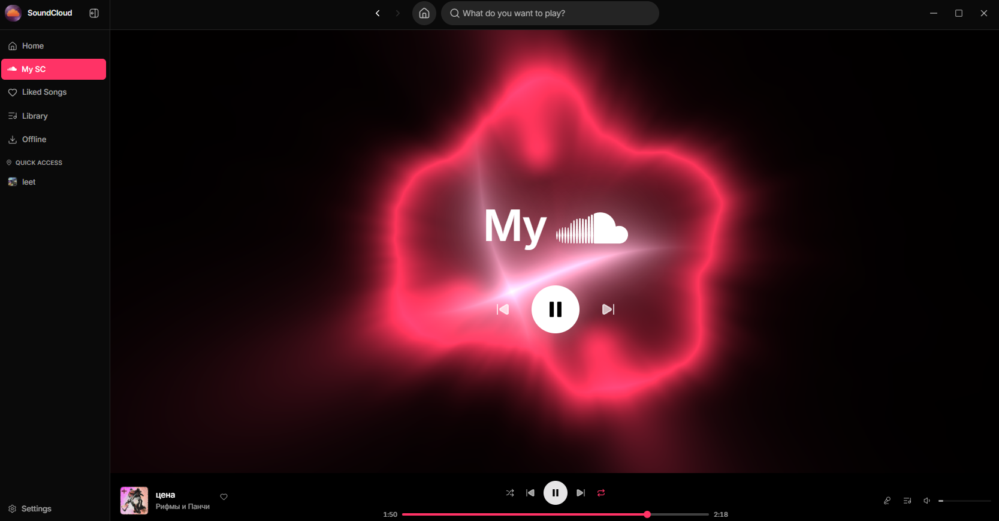
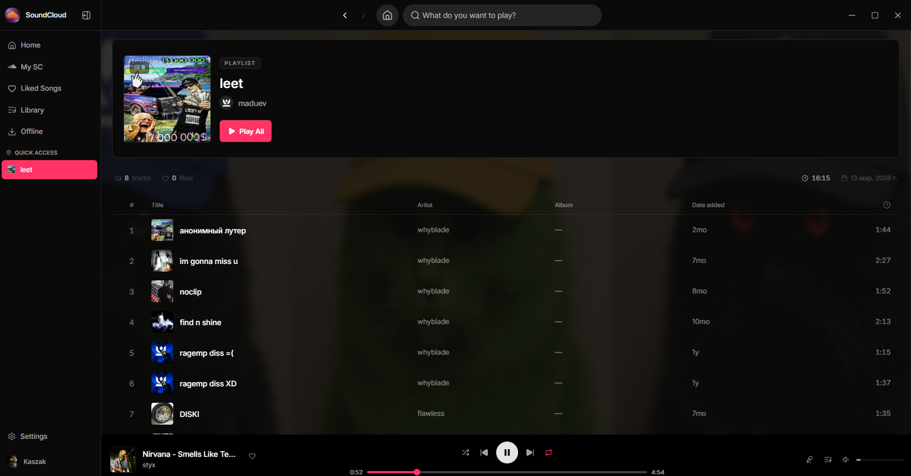
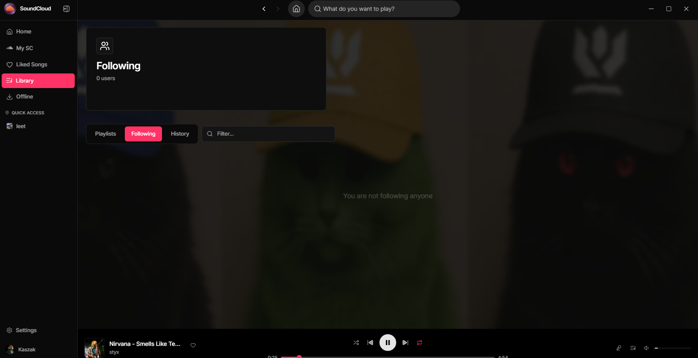
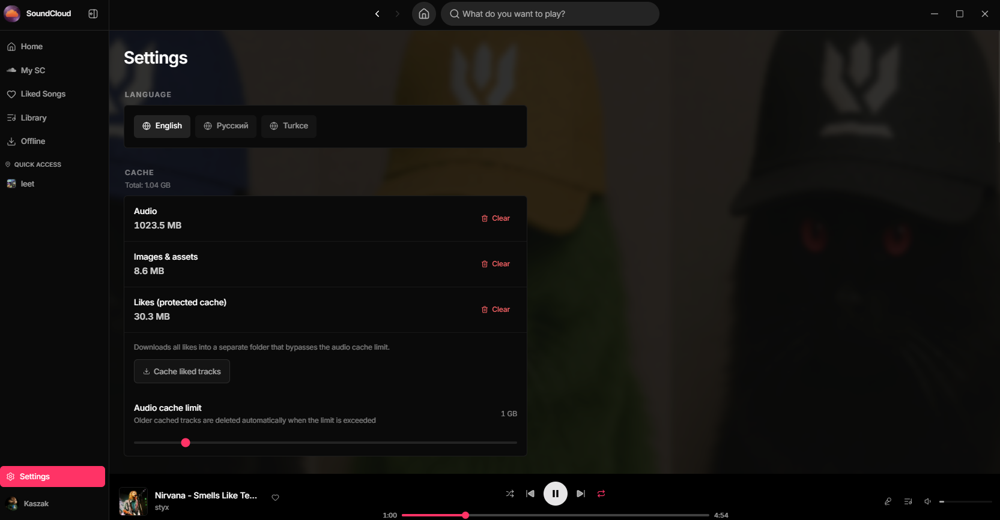

<p align="center">
<a href="https://github.com/huesss/sc-desktop-beautiful/releases/latest">

</a>
</p>

<h1 align="center"><a href="https://github.com/huesss/sc-desktop-beautiful">SC Desktop Beautiful</a></h1>

<p align="center">
<b>Красивый нативный клиент SoundCloud для десктопа</b><br>
Glass UI · Без рекламы · Без капчи · Tauri 2 + React 19
</p>

<p align="center">
<a href="https://github.com/huesss/sc-desktop-beautiful/releases/latest">

</a>
<a href="https://github.com/huesss/sc-desktop-beautiful/releases">

</a>
<a href="https://github.com/huesss/sc-desktop-beautiful/stargazers">

</a>
<a href="https://github.com/huesss/sc-desktop-beautiful/blob/main/LICENSE">

</a>
</p>

<p align="center">
<a href="https://github.com/huesss/sc-desktop-beautiful/releases/latest">

</a>
</p>

---

<p align="center">

</p>

---

## Что это?

**SC Desktop Beautiful** — десктопное приложение для SoundCloud с переработанным интерфейсом: тёмная тема, glass-панели, акцентный розовый цвет и плавная анимация. Сборка на **Tauri 2** и **React 19** — нативно, легко и без Electron.

Текущая версия: **PreRelease v1**. Платформы: **Windows**, **Linux**, **macOS**.

---

## Возможности

### Интерфейс

- Glass UI с размытым фоном и читаемыми панелями
- Быстрый доступ: Liked Songs, Library, плейлисты из сайдбара
- Таблица лайков в стиле Spotify — сортировка, фильтр, обложки
- Экран **My SC** с крупным плеером и визуализацией
- Настройки: язык (EN / RU / TR), кэш аудио и обложек, офлайн-лайки

### Музыка и система

- Воспроизведение через нативный аудиодвижок (rodio)
- Очередь, шаффл, repeat, эквалайзер, lyrics, vibe search
- Discord Rich Presence, MPRIS / системные медиа-кнопки
- Кэш треков и защищённая папка для лайков
- Автообновления через GitHub Releases

### Доступность

- Работает без рекламы и капчи веб-клиента
- Обход региональных ограничений SoundCloud
- Интерфейс на русском, английском и турецком

---

## Скачать

Сборки — на [странице релизов](https://github.com/huesss/sc-desktop-beautiful/releases/latest).

### Windows

- **`.exe`** (NSIS) — рекомендуется
- **`.msi`** — альтернатива

Требования: Windows 10 (1809+) или Windows 11

### Linux

| Формат | Архитектура | Описание |
|--------|-------------|----------|
| `.deb` | amd64, arm64 | Debian, Ubuntu, Mint |
| `.rpm` | amd64, arm64 | Fedora, openSUSE |
| `.AppImage` | amd64, arm64 | Универсальный |
| `.flatpak` | amd64 | Flatpak |

```bash
chmod +x sc-desktop-beautiful-*.AppImage
./sc-desktop-beautiful-*.AppImage
```

### macOS

- **Apple Silicon**: `*_arm64.dmg`
- **Intel**: `*_x64.dmg`

> [!NOTE]
> Если Gatekeeper блокирует запуск:
> ```bash
> xattr -cr /Applications/sc-desktop-beautiful.app
> ```

---

## Скриншоты

<p align="center">


</p>

<p align="center">


</p>

<p align="center">


</p>

---

## Обратная связь

| | |
|---|---|
| Баг или идея | [Issues](https://github.com/huesss/sc-desktop-beautiful/issues) |
| Обсуждения | [Discussions](https://github.com/huesss/sc-desktop-beautiful/discussions) |
| Звезда репо | [Stargazers](https://github.com/huesss/sc-desktop-beautiful/stargazers) |

Pull requests приветствуются. Для крупных изменений сначала открой issue.

---

## Сборка из исходников

<details>
<summary><b>Инструкция для разработчиков</b></summary>

### Требования

- **Node.js** 22+
- **pnpm** 10+
- **Rust** 1.77+ (stable)

### Запуск

```bash
git clone https://github.com/huesss/sc-desktop-beautiful.git
cd sc-desktop-beautiful/desktop
pnpm install
pnpm tauri dev
```

### Production-сборка

```bash
pnpm tauri build
```

Артефакты: `desktop/src-tauri/target/release/bundle/`.

### Проверки

```bash
npx tsc --noEmit
cargo check --manifest-path src-tauri/Cargo.toml
npx biome check src/
```

</details>

---

## Стек

| Компонент | Технология |
|-----------|------------|
| Оболочка | Tauri 2 (Rust) |
| Фронтенд | React 19, Vite 7, Tailwind CSS 4 |
| Стейт | Zustand, TanStack Query |
| Аудио | rodio |
| UI | Radix UI |
| Бэкенд | NestJS, PostgreSQL |
| CI/CD | GitHub Actions |
| Линтер | Biome |

---

## Статистика

<p align="center">

</p>

<p align="center">


</p>

---

## Лицензия

MIT — см. [LICENSE](LICENSE).

SoundCloud — торговая марка SoundCloud Ltd. Проект не аффилирован с SoundCloud.

---

<p align="center">
<code>sc desktop beautiful</code> · <code>soundcloud desktop</code> · <code>soundcloud клиент</code> · <code>soundcloud для пк</code> · <code>soundcloud без рекламы</code> · <code>soundcloud tauri</code> · <code>glass ui music player</code>
</p>

<p align="center">
<a href="https://github.com/huesss/sc-desktop-beautiful/releases/latest">

</a>
</p>
